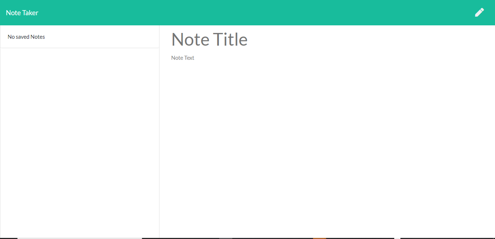

# Project Note Taker

## Description
This application allows the user to store thier notes, retrieve old notes, and delete unwanted notes. Users data is stored when the user makes a post request to the server, which sends the notes in an object format and stores it in a json file. Users can retrieve old notes via a get request which reads the data from the JSON file and sends it to the user in a JSON format. Users can delete their notes via a delete request which identifies the object element of old notes via a unique id, and thus deletes that element and sends the updated data back into the persistent json file. 

## User Story

AS A user, I want to be able to write and save notes

I WANT to be able to delete notes I've written before

SO THAT I can organize my thoughts and keep track of tasks I need to complete

## Business Context

For users that need to keep track of a lot of information, it's easy to forget or be unable to recall something important. Being able to take persistent notes allows users to have written information available when needed.

## Image

## Link
https://github.com/sid-666/Note-Taker